title:     documentation of the installation
desc:       quick glance at pictures of the build process
date:       2021/12/15
version:    2.0.0
template:   document
nav:        Spring 2021 Documentation>process photos and documentation
percent:    100
authors:    freakylamps@gmail.com

# Spring 2021 - ECE4873 capstone documentation 

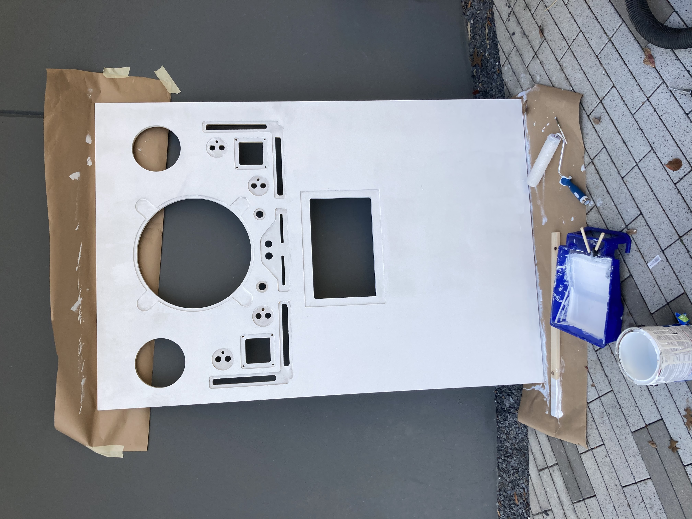
Here is CNC panel with a fresh coat of primer!
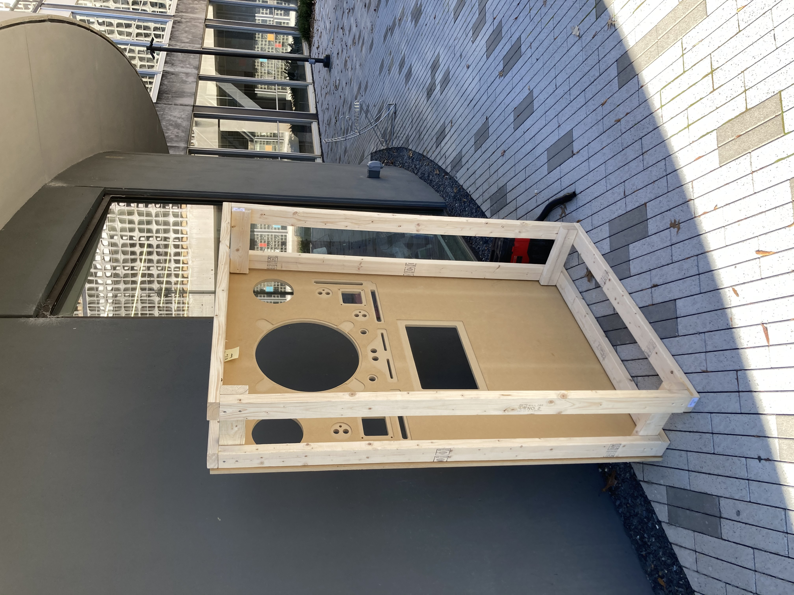
About to attach the front panel to the frame
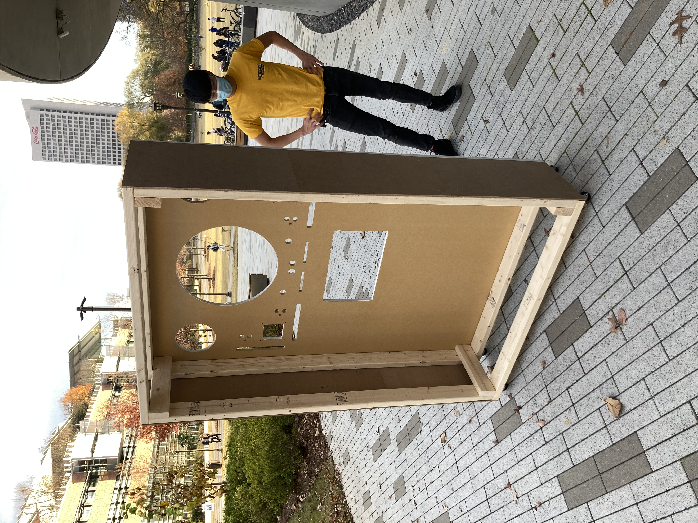
The assembled frame and panel
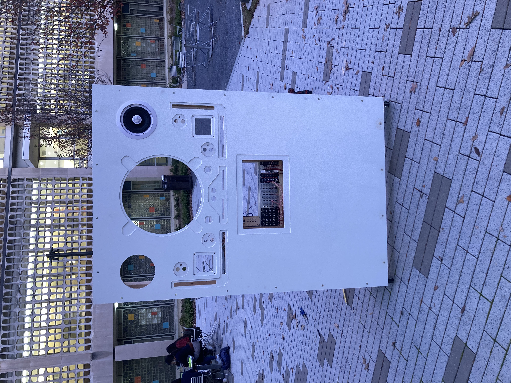
Mouting the synthesizer was the first step to bringing the installation to life!
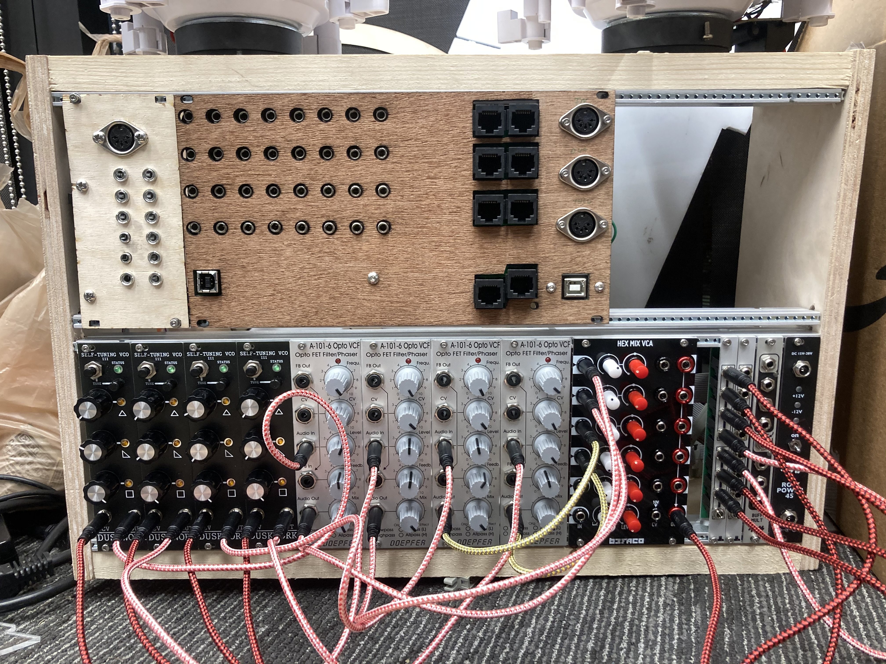
Closeup of the synth (before jacks were labelled)
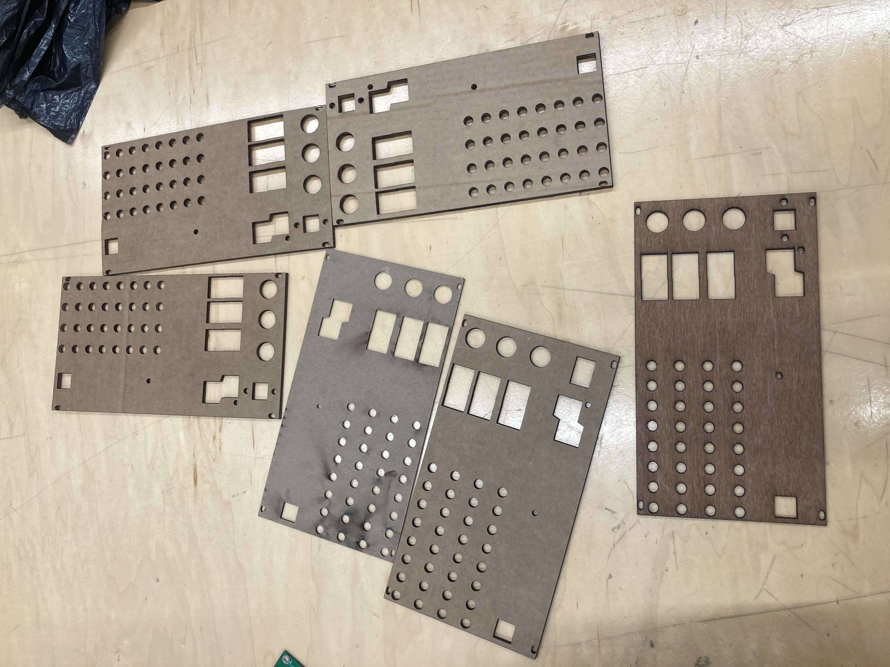
This is how many panel laser cuts it took to get the PCB to fit perfectly to the front panel.
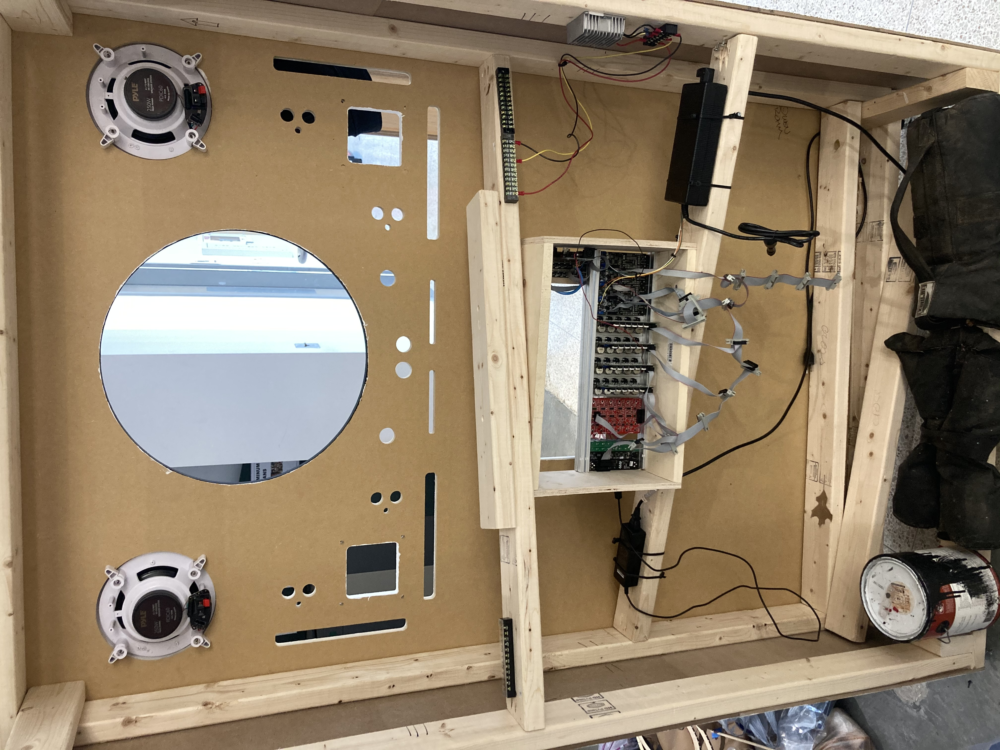
The wiring process has started
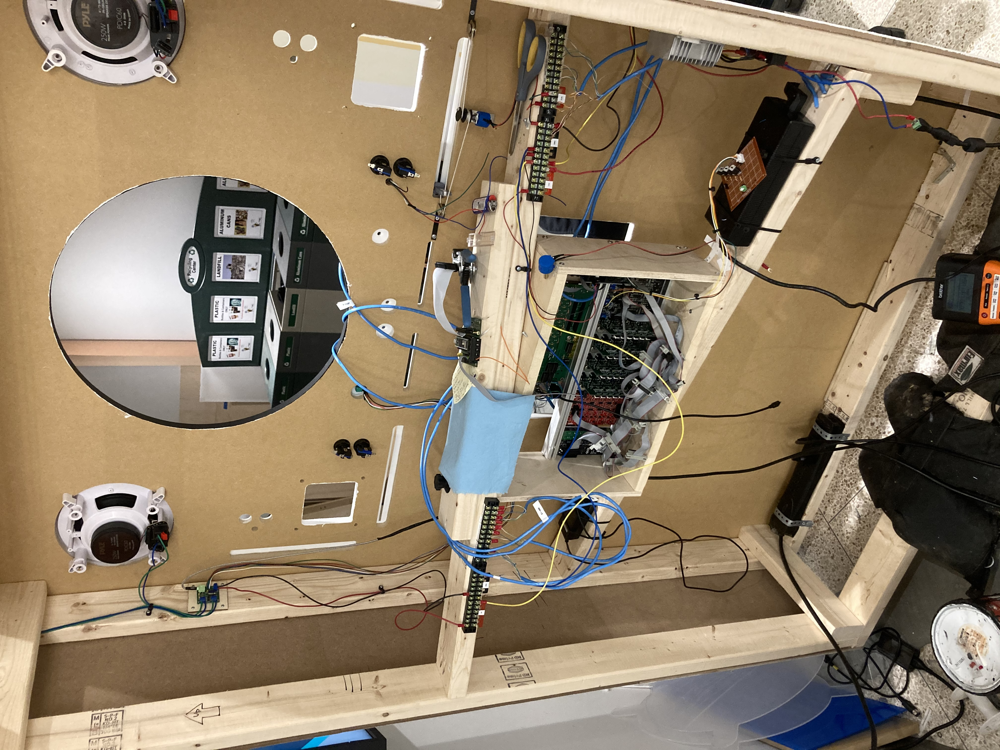
Going deeper with the wiring. Note the perf board on the right, that is a small board we with 4 MOSFETs so we can send a tuning signal out to the oscillators. 
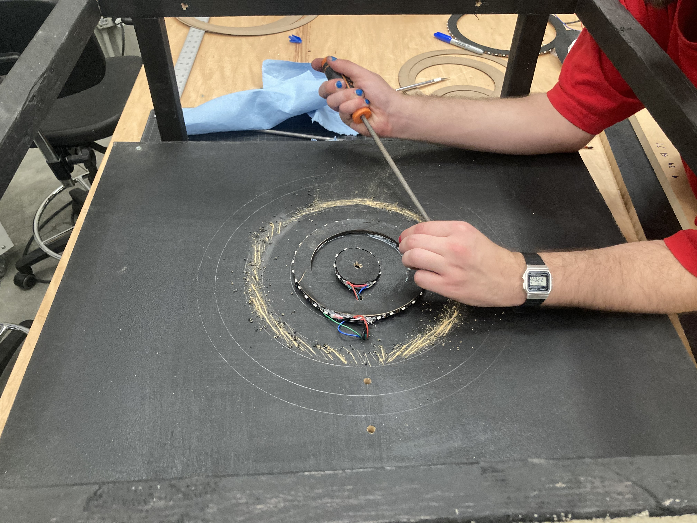
We had to do some scuffing up of the paint to get the LED rings to adhere to the back panel. 
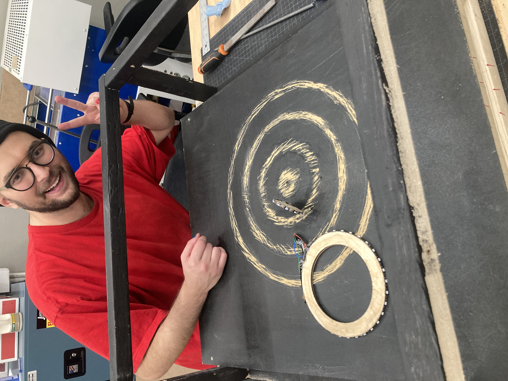
ready to glue the LED rings to the panel!
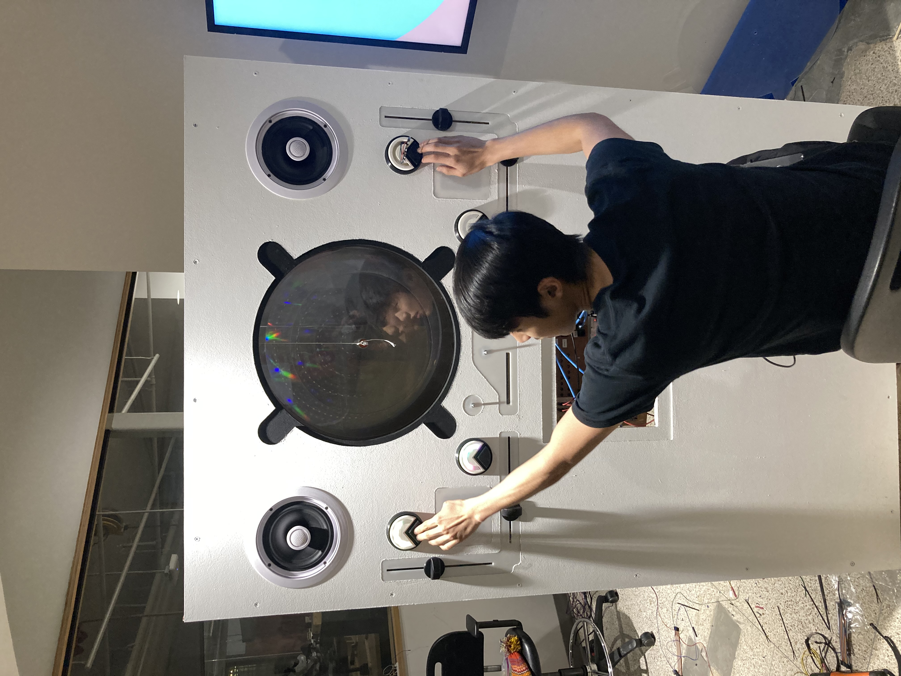
Andrew is calibrating the buttons 
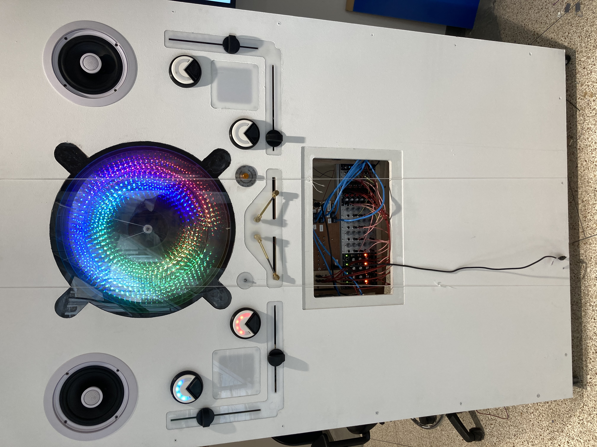
The installation is almost done!
