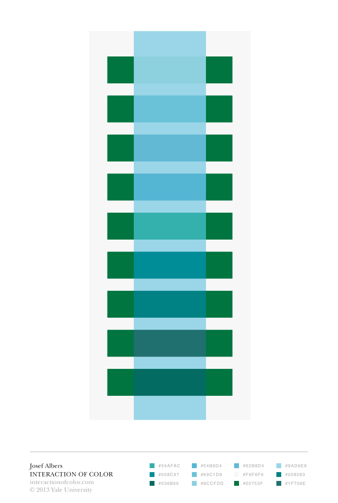
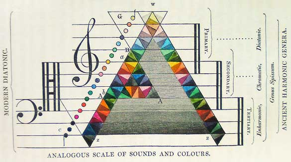

title:      Creative Considerations
desc:       Design and inspration of the installation
date:       2021/4/27
version:    1.0.0
template:   document
nav:        Design__2__>Creative Considerations
percent:    100
authors:    freakylamps@gmail.com

# Creative Design Choices 

## Inspirations
This installation came about as way to explore the relationship between sound and light in playful and inspiring way. It was inspired by [color theory ideas presented by Josef Albers](https://www.brainpickings.org/2013/08/16/interaction-of-color-josef-albers-50th-anniversary/), the [synesthesia of Alexander Scriabin](https://en.wikipedia.org/wiki/Clavier_%C3%A0_lumi%C3%A8res), and the other worldly colors and repurposing of common object that permeates the work of the Puerto Rican puppet troupe [Poncili Creación](https://bombmagazine.org/articles/poncili-creaci%C3%B3n-interviewed/). 

**Figure 1. Plate from Josef Alber's Interaction of Colors. Served as initial inspiration for design of backlit color panels**

**Figure 2. Early scale of sound and color relationship **
## User Interface

The user interface was designed with play in mind. The knobs and switches on the front all come from repurposed vintage test equipment and other miscellaneous found objects. The switches at the bottom serve as sort of piano keyboard where the user can play different notes and see and hear them on the synthesizer, as well as sequence those notes and hear them play back.  This installation was conceived before the Covid-19 pandemic, and now there are thoughts of making some of the controls touch free using proximity and light sensors. 
The interior of the sculpture consists of backlit translucent acrylic. The different color sections are separated by a piece of wood blocking light from one section to the other. Each section's color corresponds to a different oscillator's pitch. 

**Figure 3. Preliminary annotated diagram of functionality of the sculpture**